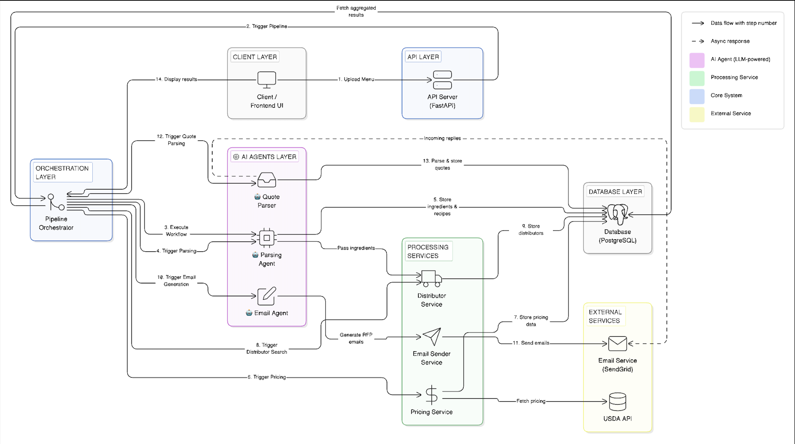
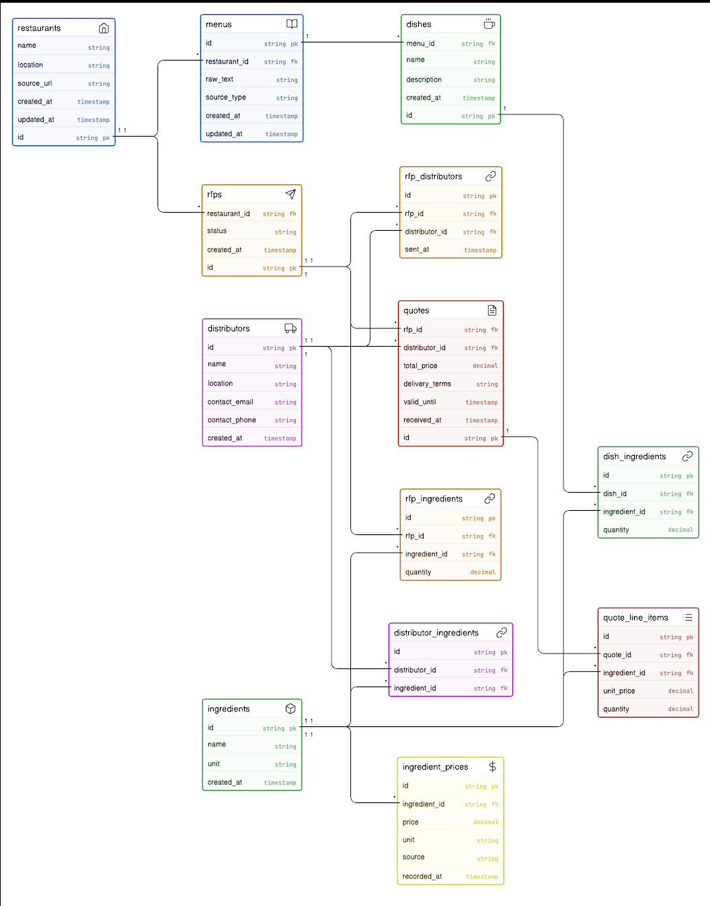

# Restaurant Procurement AI

## Overview

Restaurant sourcing is often manual, slow, and fragmented across spreadsheets, email threads, and vendor follow-ups. Teams must identify ingredients, compare supplier pricing, send RFQs/RFPs, collect quotes, and decide on suppliers under time pressure.

### Sample menu URL:
https://static1.squarespace.com/static/5c7b6f7e2727be77abdf5890/t/6914ef2b0907c65d1e3faa39/1762979627485/20251112+PX+Tri-Fold+Menu+INSIDE-compressed.pdf

### Demo URL:
https://drive.google.com/file/d/1KT9R7fzdg1d0f8UdTkrcw3jIn7Ty5tNU/view?usp=sharing

**Restaurant Procurement AI** automates this workflow end-to-end:

**Menu → Ingredients → Pricing → Distributors → RFP → Quotes → Recommendation**

The system is designed to improve procurement speed, pricing visibility, and consistency in supplier selection through structured data and intelligent pipeline orchestration.

## System Architecture

The platform is composed of the following core layers:

- **Frontend (Streamlit)**
  - Interactive UI for running the pipeline
  - Step-by-step visualization of parsing, pricing, distributors, and quote comparison

- **Backend (FastAPI)**
  - API layer and orchestration for the procurement pipeline
  - Integrates parsing, pricing, email, quote ingestion, and recommendation logic

- **Database (SQLite)**
  - Persists normalized procurement entities
  - Stores ingredient pricing history for trend analysis over time

- **AI-assisted agents (Local LLM via Ollama)**
  - Menu/dish/ingredient extraction using local LLM inference
  - Email (RFP) generation tailored to distributor context
  - Supplier quote parsing from unstructured responses

- **Services Layer**
  - Pricing service (including trend-aware price retrieval)
  - Distributor matching service
  - Email send/ingest services
  - Quote comparison and recommendation engine

## Architecture Diagram



## Pipeline Workflow

1. **Upload menu**
   - User submits menu input through the Streamlit interface.

2. **Parse dishes and ingredients**
   - Menu content is transformed into structured dishes, ingredients, and quantities.

3. **Fetch pricing and compute trends**
   - Ingredient prices are fetched and stored.
   - Historical prices are used to derive pricing trends.

4. **Find distributors**
   - Matching distributors are identified based on available ingredients.

5. **Generate and send RFP emails**
   - RFPs are created and sent to selected suppliers.

6. **Ingest quotes**
   - Supplier quote responses are ingested (email/mock flow) and normalized.

7. **Compare quotes**
   - Distributor quote totals are computed across requested items.

8. **Recommend best distributor**
   - Lowest-cost valid option is surfaced as recommendation.

## Example Usage

1. Enter restaurant name, location, and menu URL in the UI.
2. Click **"Run Pipeline"**.
3. View parsed dishes and extracted ingredients.
4. Review ingredient pricing and trends.
5. See identified distributors.
6. Generate quotes.
7. Compare quotes and view the recommended distributor.

## Database Design

The schema captures the full procurement lifecycle with relational consistency:

- **Restaurant → Menu → Dish → DishIngredient**
  - Represents menu structure and ingredient usage per dish.

- **Ingredient + IngredientPrice (time-series)**
  - Ingredients are stored as master data.
  - `IngredientPrice` stores historical snapshots for trend analysis.

- **Distributor + DistributorIngredient**
  - Models supplier inventory coverage.
  - Supports many-to-many mapping between distributors and ingredients.

- **RFP + RFPIngredient**
  - Stores procurement requests and required ingredient-level quantities.

- **Quote + QuoteLineItem**
  - Captures distributor responses and line-level quoted pricing.
  - Enables quote comparison and recommendation.

Relationship patterns include one-to-many (e.g., Restaurant→Menus) and many-to-many via junction tables (e.g., Distributors↔Ingredients).

## Database Schema



## Project Structure

```text
backend/
  app/
frontend/
docs/
```

## How to Run

1. **Clone the repository**

2. **Start backend**
   - Navigate to the backend directory.
   - Install dependencies (from `requirements.txt`).
   - Run:
     ```bash
     uvicorn app.main:app --reload
     ```

3. **Start frontend**
   - Navigate to the frontend directory.
   - Run:
     ```bash
     streamlit run app.py
     ```

4. **Open the application**
   - http://localhost:8501

## Tech Stack

- Python
- FastAPI
- SQLAlchemy
- SQLite
- Streamlit
- Ollama (Local LLM runtime)
- Llama3 (or compatible local model)

## Key Highlights

- End-to-end automated procurement pipeline
- Pricing trend analysis using historical ingredient price data
- Realistic RFP generation and outbound supplier communication
- Quote ingestion and apples-to-apples supplier comparison
- Clean step-by-step UI for operational visibility
